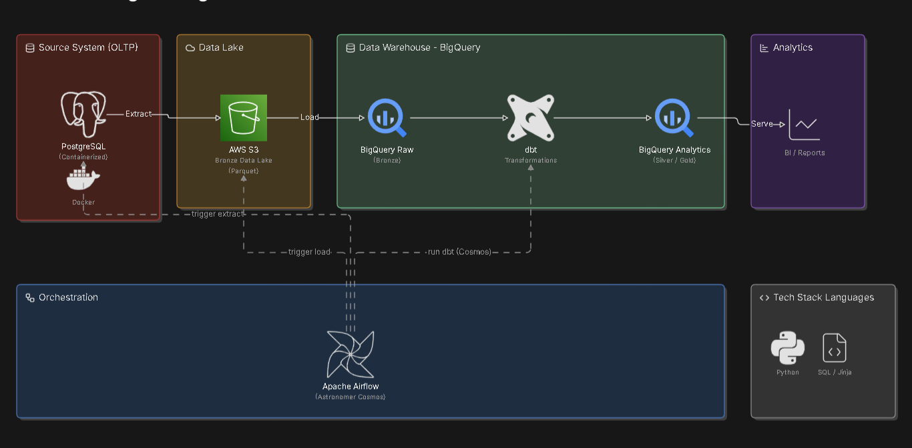
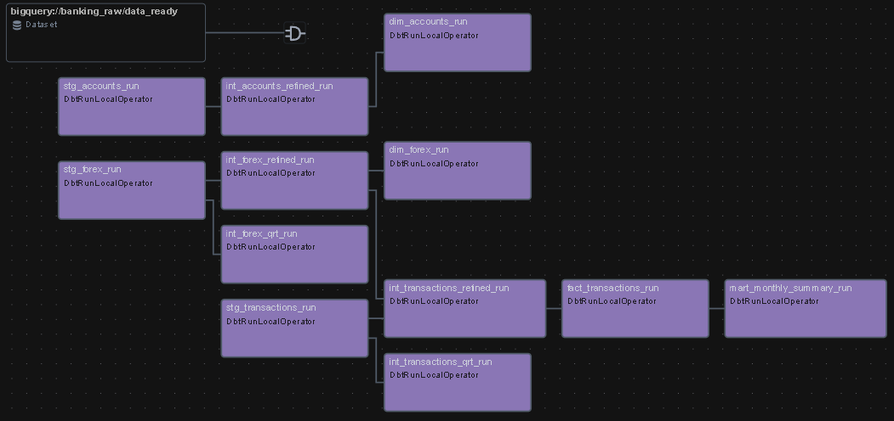

# Data-Aware Banking Data Pipeline (Medallion Architecture)

## 📌 Overview
This project is an end-to-end data engineering pipeline designed to process daily banking transactions, account statuses, and forex data. Built utilizing modern data engineering practices, the pipeline orchestrates data extraction from cloud storage (AWS S3) and performs robust transformations within Google BigQuery using a Medallion Architecture approach (Bronze -> Silver -> Gold) to serve analytical workloads.

## 🏗️ Architecture & Tech Stack



* **Source System (OLTP):** PostgreSQL (Local / Containerized)
* **Orchestration:** Apache Airflow (Astronomer Cosmos)
* **Data Warehouse:** Google BigQuery (Native Tables)
* **Data Lake / Object Storage:** AWS S3
* **Transformation:** dbt (Data Build Tool)
* **Language:** Python, SQL (Jinja)

## ⚙️ Key Architectural Decisions

To ensure reliability, scalability, and data integrity, this pipeline incorporates several enterprise-grade design patterns:

**1. Decoupled EL & T Pipelines**
Ingestion (Extract & Load) and Transformation workflows are physically separated into distinct DAGs. If the dbt transformation fails due to upstream schema drift, the ingestion DAG will continue to land raw data safely into the Bronze layer, improving pipeline resiliency and isolating failure domains.

**2. Data-Aware Scheduling (Airflow Datasets)**
Instead of relying on fragile cron-based time schedules, this pipeline utilizes Airflow Datasets. The `medallion_banking` DAG is configured to trigger automatically only after the `s3_to_bq` ingestion DAG successfully completes. This logical dependency prevents blind runs and ensures downstream models only execute when new data is physically present.

**3. Quarantine Pattern for Data Quality**
Financial data requires strict auditing. Instead of quietly dropping null or corrupted records during staging, the pipeline evaluates data quality dynamically. Invalid records are flagged and routed into dedicated Quarantine tables (`int_transactions_qrt`, `int_forex_qrt`) in the Silver layer for auditing, ensuring the Gold layer remains pristine without losing traceability of bad data.

**4. Slowly Changing Dimensions (SCD Type 2) & Idempotency**
* **SCD Type 2:** Customer account changes (e.g., tier upgrades, credit limit changes) are tracked historically in `dim_accounts` using surrogate keys, `valid_from`, `valid_to`, and `is_current` flags, preserving the state of the dimension at the time of any transaction.
* **Idempotency:** `MERGE` strategies are enforced using unique composite keys across the intermediate and mart layers, preventing data duplication even if the Airflow DAG is re-run multiple times for the same execution date.

**5. Optimized BigQuery Storage**
Avoided BigQuery External Tables for transactional data. Instead, Python's `BigQueryHook` (with `WRITE_APPEND`) is used to write data physically into BigQuery Native Tables at the Bronze layer, significantly improving query performance and reducing compute costs for downstream dbt transformations.

## 📂 Repository Structure
```text
.
├── dags/
│   ├── 0_banking_dag_historical.py         # Orchestrates historical mock data generation
│   ├── 0_banking_dag_daily.py              # Orchestrates daily mock data generation
│   ├── 1_db_to_s3_historical.py            # Extracts historical data to AWS S3
│   ├── 1_db_to_s3_daily.py                 # Extracts daily incremental data to AWS S3
│   ├── 2_s3_to_bq_historical.py            # Ingests historical data from S3 to BigQuery Native Tables
│   ├── 2_s3_to_bq_daily.py                 # Ingests daily data from S3 to BigQuery (Emits Airflow Dataset)
│   └── 3_medallion_banking.py              # Astronomer Cosmos DAG for dbt models (Data-Aware scheduling)
├── include/
│   ├── ingestion/                          # Custom Python loaders and extractors
│   └── dbt/banking_data_pipeline/
│       ├── models/
│       │   ├── 1_staging/                  # View materializations & data cleansing
│       │   ├── 2_intermediate/             # Incremental loads, Deduplication & Quarantine 
│       │   └── 3_marts/                    # Gold layer (Star Schema: dim_accounts, fct_transactions)
│       └── macros/                         # Custom Jinja macros (audit_columns, schema_name)
├── requirements.txt                        # Python dependencies
└── Dockerfile                              # Astro Runtime custom image

```

## 🚀 Local Development Guide
(Note: Executing this pipeline requires active AWS and GCP Service Account credentials.)

**1. Clone the repository:**
```bash
git clone https://github.com/hannanrazalli/banking-transaction-data-pipeline.git
cd banking-transaction-data-pipeline
```

**2. Environment Variables:**
Create a .env file in the root directory and configure your cloud credentials securely (Ensure .env is added to your .gitignore to prevent credential leaks).

**3. Start the Airflow Cluster:**
```bash
astro dev start
```

**4. Access Airflow UI:**
Navigate to http://localhost:8080 (Default credentials: admin/admin).


## 📊 Pipeline Visualizations & Proof of Execution

### 1. dbt Medallion Architecture Lineage Graph
This graph illustrates the modular dependency and data flow from raw staging tables to downstream analytical marts inside Google BigQuery:



### 2. Orchestration DAGs (Successful Runs)
Proof of execution for all historical and daily pipeline DAGs running successfully within the local Astro Runtime environment:

