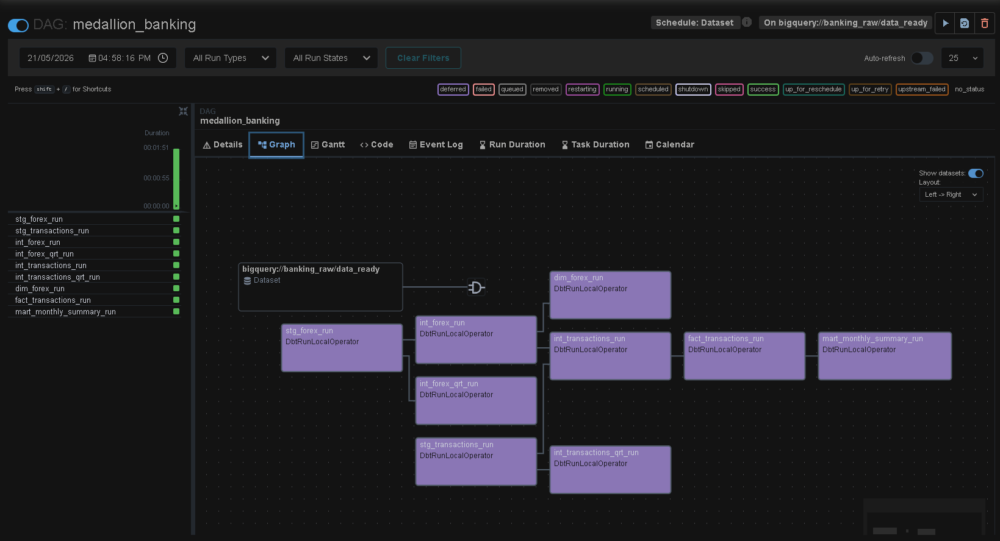
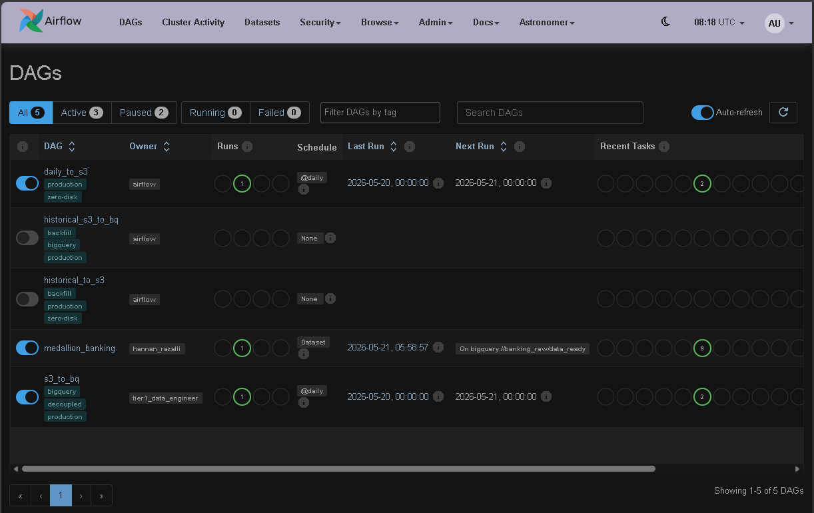

# Data-Aware Banking Data Pipeline (Medallion Architecture)

## 📌 Overview
This project is a portfolio-focused data engineering pipeline designed to process daily banking transactions and forex data. It was built using modern data engineering practices commonly found in production-oriented analytics platforms, orchestrating data extraction from cloud storage (AWS S3) and transforming it within Google BigQuery using a Medallion Architecture approach (Bronze -> Silver -> Gold).

## 🏗️ Architecture & Tech Stack
*(Insert your Architecture Diagram here using Excalidraw / Draw.io)*

* **Orchestration:** Apache Airflow (Astronomer Cosmos)
* **Data Warehouse:** Google BigQuery (Native Tables)
* **Data Lake / Object Storage:** AWS S3
* **Transformation:** dbt (Data Build Tool)
* **Language:** Python, SQL (Jinja)

## ⚙️ Key Architectural Decisions

As a portfolio-focused data engineering project designed around modern industry practices, several production-oriented design patterns were implemented:

**1. Decoupled EL & T Pipelines**
Ingestion (Extract & Load) and Transformation workflows are physically separated into distinct DAGs. If the dbt transformation fails due to upstream schema drift, the ingestion DAG will continue to land raw data safely into the Bronze layer, improving pipeline resiliency and reducing the risk of data loss.

**2. Data-Aware Scheduling**
Instead of relying on fragile cron-based time schedules, this pipeline utilizes **Airflow Datasets**. The `medallion_banking` DAG is configured to run automatically after the `s3_to_bq` ingestion DAG successfully completes. This creates a logical dependency that prevents blind runs and helps ensure data readiness.

**3. Idempotency & Incremental Processing**
* **Idempotency:** Re-running the pipeline for the same execution date handles duplicate records effectively. `MERGE/UPSERT` strategies are enforced using unique composite keys (`transaction_id`).
* **Incremental Loading:** Configured dbt materializations to perform full-refreshes in local environments while primarily using incremental loading strategies through environment-based configurations (`"full_refresh": not IS_PROD`), helping optimize BigQuery compute costs.

**4. Optimized BigQuery Storage**
Avoided BigQuery External Tables for transactional data. Instead, Python's `BigQueryHook` (with `WRITE_APPEND`) is used to write data physically into BigQuery Native Tables at the Bronze layer, improving query performance for downstream analytical workloads.
## 📂 Repository Structure
```text
.
├── dags/
│   ├── historical_to_s3.py         # One-off backfill DAG
│   ├── historical_s3_to_bq.py      # One-off backfill DAG
│   ├── daily_to_s3.py              # Daily incremental extraction to S3
│   ├── s3_to_bq.py                 # Ingestion from S3 to BigQuery (Emits Airflow Dataset)
│   └── medallion_banking.py        # Astronomer Cosmos DAG for dbt models
├── include/
│   ├── ingestion/                  # Custom Python loaders and extractors
│   └── dbt/banking_data_pipeline/  # dbt project (models, macros, tests)
├── requirements.txt                # Python dependencies
└── Dockerfile                      # Astro Runtime custom image

```

🚀 How to Run Locally

**1. Clone the repository:**
```bash
git clone https://github.com/hannanrazalli/banking-transaction-data-pipeline.git
cd banking-transaction-data-pipeline
```

**2. Environment Variables:**
Create a .env file in the root directory and configure your cloud credentials securely (Do not commit your GCP JSON key).

**3. Start the Airflow Cluster:**
```bash
astro dev start
```

**4. Access Airflow UI:**
Navigate to http://localhost:8080 (Default credentials: admin/admin).


## 📊 Pipeline Visualizations & Proof of Execution

### 1. dbt Medallion Architecture Lineage Graph
This graph illustrates the modular dependency and data flow from raw staging tables to downstream analytical marts inside Google BigQuery:



### 2. Orchestration DAGs (Successful Runs)
Proof of execution for all historical and daily pipeline DAGs running successfully within the local Astro Runtime environment:

